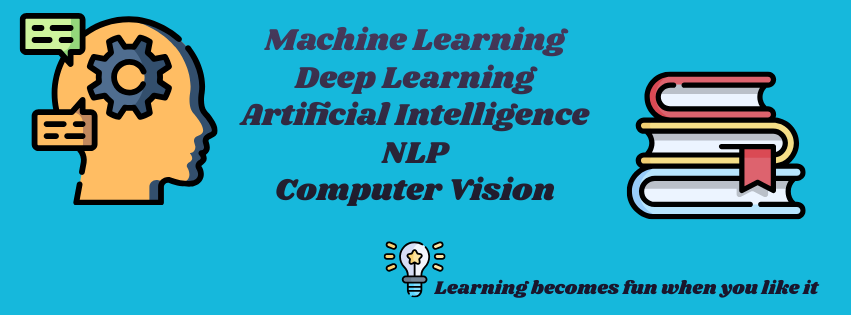

# 😎 Welcome to My Arena of Interview Preparation – My Way

### Machine Learning 🤖

**Definition:** Machine Learning is a subset of artificial intelligence that enables systems to automatically learn and improve from experience without being explicitly programmed. It focuses on the development of algorithms that allow computers to learn patterns from data and make predictions or decisions.

### Deep Learning 🧠

**Definition:** Deep Learning is a specialized field of Machine Learning where artificial neural networks, inspired by the structure and function of the human brain, learn from large amounts of data. It involves complex algorithms and architectures with multiple layers (deep neural networks) to model high-level abstractions in data.

### Artificial Intelligence (AI) 🤯

**Definition:** Artificial Intelligence refers to the simulation of human intelligence in machines, enabling them to perform tasks that typically require human intelligence. It encompasses various techniques and approaches to create machines capable of reasoning, learning, problem-solving, and understanding natural language.

### Natural Language Processing (NLP) 📝

**Definition:** Natural Language Processing is a branch of AI that deals with the interaction between computers and human language. It involves the analysis, understanding, and generation of human language by computers, enabling machines to comprehend, interpret, and generate text or speech.

### Computer Vision 👁️

**Definition:** Computer Vision is an interdisciplinary field that enables computers to interpret and understand visual information from the real world. It involves developing algorithms and techniques to extract meaningful information from images or videos, allowing machines to perceive, analyze, and make decisions based on visual data.

😉 Many Thanks for your time !!

## Authors

- [@LinkedIn Khan MD Shibli Nomani](https://www.linkedin.com/in/khan-md-shibli-nomani-45445612b/)
